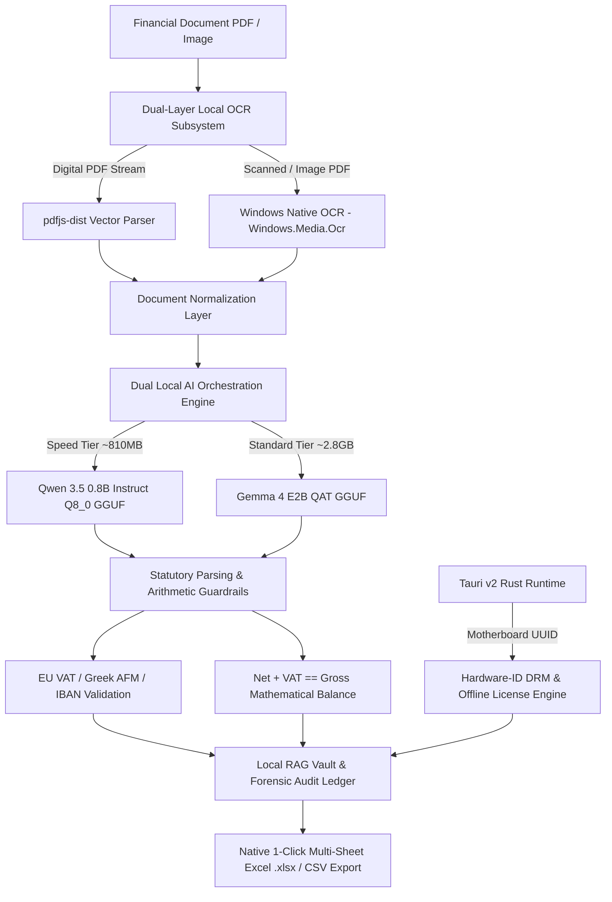

# 🏗️ Qexur CA — Technical Architecture & Deep-Tech Blueprint

This document details the architectural layers, data flow, offline LLM runtime orchestration, and security guardrails of the **Qexur CA Desktop AI Financial Document Extraction & Forensic Audit Platform**.

---

## 🏛️ System Architecture Overview

---

## 🛠️ Detailed Component Breakdown

### 1. Presentation Layer (Frontend)
* **Framework:** React 19 + Vite.
* **Aesthetics:** High-density Glassmorphic Dark Architecture (`#09090b` canvas, responsive audit tables, subtle borders, zero UI bloat).
* **Export Engine:** Native SheetJS (`xlsx`) integration with dynamic column auto-fitting, automated worksheet segregation, and RFC 4180 UTF-8 BOM CSV generation for international currency display.

### 2. Native Desktop Runtime Layer (Backend)
* **Container:** Tauri v2 (`src-tauri`).
* **Language:** Rust (2021 Edition).
* **Footprint:** Extremely lightweight native binary (~50 MB base RAM vs ~500 MB on traditional Electron wrappers).
* **IPC Protocol:** Strongly typed, memory-safe Tauri Commands (`#[tauri::command]`) for model streaming, sidecar process execution, and hardware inspection.

### 3. Dual-Layer Local OCR Subsystem
* **Tier 1 (Digital PDFs):** Direct text-layer stream reconstruction via `pdfjs-dist` (v4.0).
* **Tier 2 (Scanned/Image Documents):** PowerShell sidecar (`win_ocr_sidecar.ps1`) interfacing directly with Windows 10/11 native `Windows.Media.Ocr` subsystem. **Requires zero external Tesseract binaries or Python OCR dependencies.**

### 4. Local AI Model Orchestration (GGUF Runtime)
* **Engine:** Embedded `llama-server.exe` / `llama-cli.exe` runtime with dynamic GPU CUDA detection and automated CPU AVX2 fallback.
* **LowVRAM Hot-Swapping:** Custom lifecycle management in Rust that spins up, pauses, or hot-swaps model processes to release VRAM during idle states.
* **Supported Tiers:**
  * **Speed Tier:** `Qwen 3.5 0.8B Instruct (Q8_0)` (~810 MB GGUF) — Optimized for 8GB RAM laptops and high-throughput batch extraction (45–60 tok/sec).
  * **Standard Tier:** `Gemma 4 E2B QAT (Q4_K_M)` (~2.8 GB GGUF) — Deep financial reasoning and forensic cross-examination (30–45 tok/sec).

### 5. Statutory Financial Engine & Integrity Guardrails
* **EU VAT Identification:** Standardized European country-prefix validation across 20+ member states.
* **Hellenic AFM Validation:** Full statutory **Modulo-11 Checksum Algorithm** implementation for Greek tax IDs.
* **ISO 7064 IBAN Checksum:** Full **Modulo-97 Checksum Algorithm** verifying European bank routing validity.
* **Multi-Currency Ledgers:** Strict mathematical segregation for `EUR (€)`, `CHF`, `GBP (£)`, `PLN (zł)`, `SEK (kr)`, and `USD ($)`.
* **Automatic Credit Note Deductions:** Reverses accounting balances to ensure credit notes are mathematically deducted from gross expenditures.
* **Deterministic Arithmetic Audit:** Verifies \(|\text{Net Base} + \text{VAT} - \text{Gross Total}| \le 0.05\) on every transaction.

### 6. Anti-Piracy Hardware ID (HWID) DRM
* **Hardware Binding:** Cryptographically queries machine motherboard UUID and CPU identifiers via native Windows APIs (`hardware_id.rs`).
* **Offline Verification:** Validates cryptographically structured evaluation, subscription, and lifetime license keys completely offline without requiring any external server telemetry (`licensing.rs`).

---

## 🔒 Absolute Air-Gapped Privacy Guarantee

| Security Aspect | Architectural Implementation |
| :--- | :--- |
| **Data Transmission** | **0.00% External Cloud Calls** — No OpenAI, Anthropic, or external API endpoints. |
| **Telemetry & Tracking** | **Zero Telemetry** — Client financial records never leave the local machine's memory. |
| **Model Weight Storage** | Stored locally in `%APPDATA%\Qexur CA\models\` or application directory. |
| **Compliance Readiness** | 100% compliant with EU GDPR, German GoBD, Swiss FADP, and international financial confidentiality standards. |

---

## 👨‍💻 Developer Maintenance & Extensibility

* **Adding New Document Parsers:** Pure React/JavaScript modules in `src/LocalDocsRag.jsx` and `src/extractDocumentText.js`.
* **Swapping Future GGUF Models:** Place any Hugging Face GGUF model into the models directory; the Rust backend dynamically registers compatible weights.
* **Export Customization:** Add custom ERP sheets (e.g. DATEV, SAP, Exact, Tally XML) directly within the SheetJS export pipeline.
